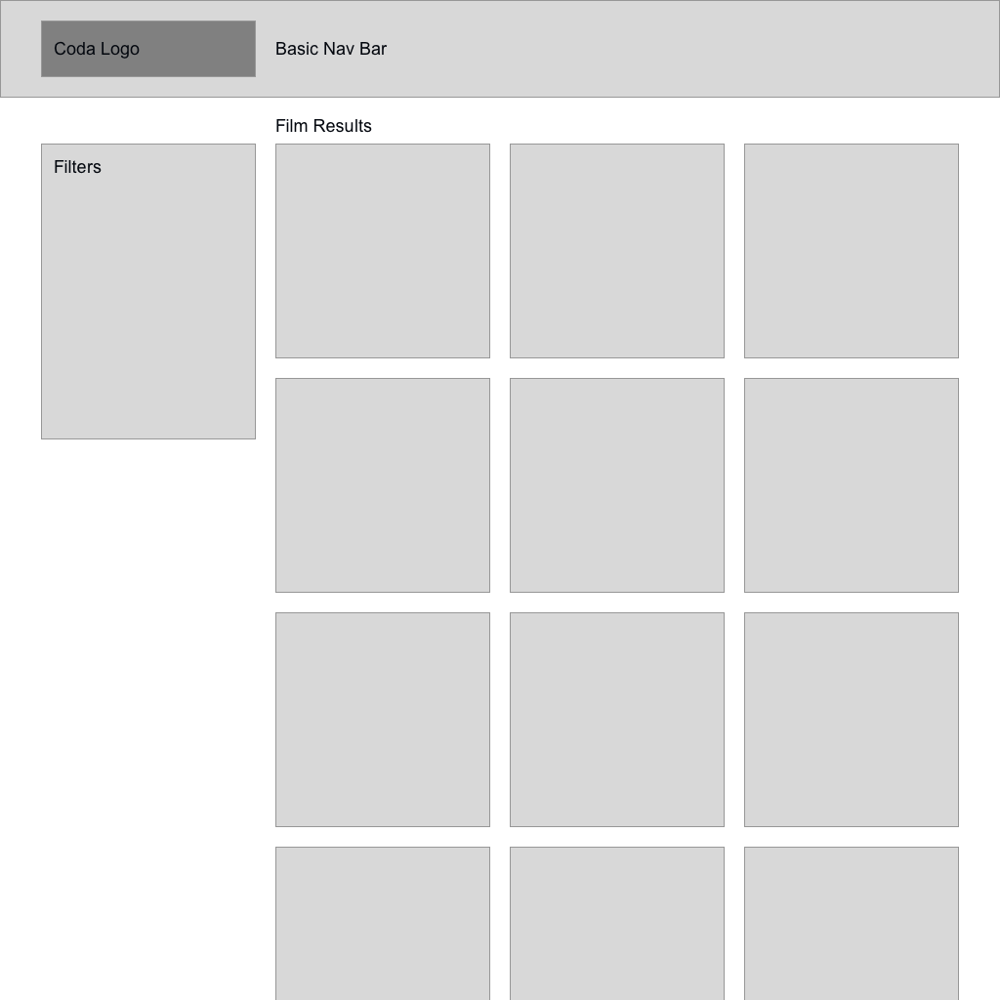

# Coda Front End Code Challenge
Much like the day-to-day work of a front end developer, there are two parts to this challenge: the visual and the functional requirements. 

We estimate that this challenge will take roughly an hour. The goal is not to make this visually perfect and complete the functional requirements, the goal is more to see how you work and how you iterate on an MVP. Don't fret if everything is not complete after about an hour.

## Objective

### Visual
When you first start the app, you should see a basic form along with a list of all videos being displayed. We'd like to see this initial layout adjusted to match the basic layout below:



A Logo has been supplied in `/public/images/logo.png`, however feel free to use another image if preferred. The layout should match the structure provided.

### Functional
We've included a suite of tests in various states of passing or failing in this repo. Your goal will be to add the functionality expected in the test suite using the components provided in `/lib`. Be mindful of the test IDs pre-populated on some components while working through this.

Feel free to browse through the test suite in `/tests`, however these tests should remain unmodified for this challenge.

Here's a quick overview of the functionality expected in these tests:
- Filtering results by genre via dropdown
- Filtering results by search query via text input
- Returning back to initial state when no filters are selected
- Displaying a friendly message to users when no results match current filters

Again, if all tests are not passing after about an hour, don't worry. We'd still like to see the work you put in as discussion material in further interviews.

## Getting Started
First, install the dependencies:
```bash
npm install
```

Then run the development server:
```bash
npm run dev
```

Open [http://localhost:3000](http://localhost:3000) with your browser to see the result.

You can start editing the page by modifying `pages/index.tsx`. The page auto-updates as you edit the file.

[API routes](https://nextjs.org/docs/api-routes/introduction) can be accessed on [http://localhost:3000/api/films](http://localhost:3000/api/films). This endpoint can be edited in `pages/api/films.ts`.

The `pages/api` directory is mapped to `/api/*`. Files in this directory are treated as [API routes](https://nextjs.org/docs/api-routes/introduction) instead of React pages.

## Running tests
As described in the ["Objective"](#objective) section near the top, you'll want to ensure that all tests are passing before resubmitting your code challenge. In order to run your tests, run:
```bash
npm test
```

If you'd prefer to have your tests run every time a change is made to your codebase, run:
```bash
npm run test:watch
```